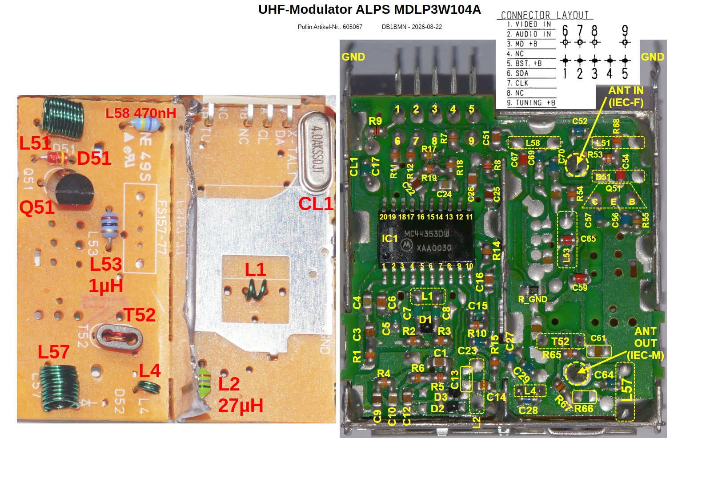
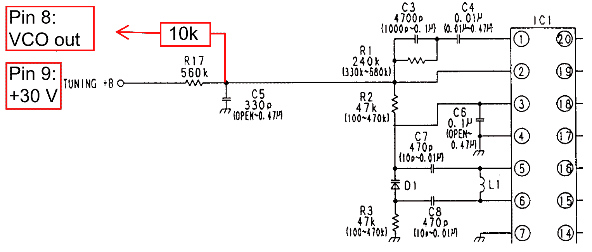
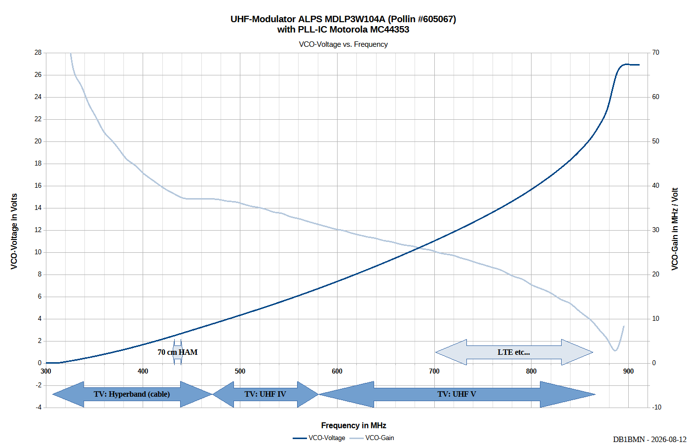
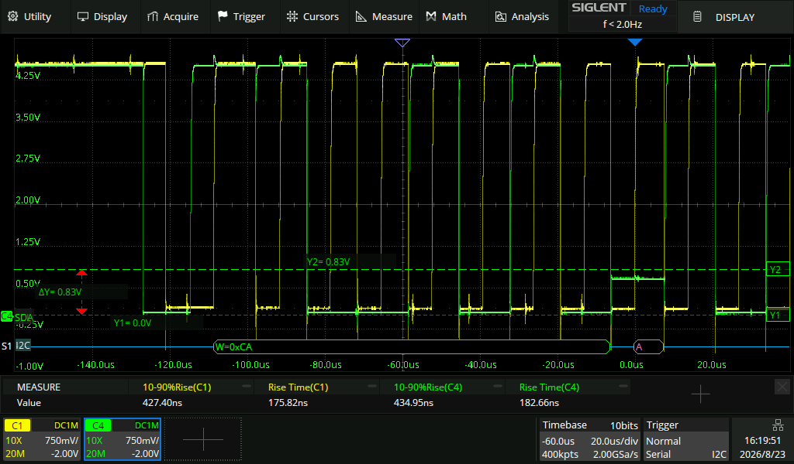

# UHF Modulator ALPS MDLP3W104A

Some reverse engineering of the UHF modulator type MDLP3W104A made by ALPS, which can be cheaply obtained from Pollin 
(Item No.: [605067](https://www.pollin.de/p/alps-uhf-modulator-mdlp3w104a-605067)).

This modulator contains the **Motorola MC44353** IC.
 

## Abstract
The built-in PLL IC MC44353 can be programmed in 250 kHz steps within a frequency range from 4.25 MHz to 1023.75 MHz (assuming a 4 MHz crystal is used). This makes it quite interesting for ham radio tinkering.

The modulator itself is advertised as a multi-standard video modulator for the UHF band, specified to cover [channels E21 to E69](https://en.wikipedia.org/wiki/Television_channel_frequencies#Western_Europe,_Greenland,_most_countries_in_Asia_and_Africa,_and_most_of_Oceania) (471.250 MHz to 855.250 MHz). However, testing showed that it can cover the 70 cm Amateur Radio Band (430 to 440 MHz) and can go as **low as Channel S23** (319.250 MHz, part of the German cable TV [Hyperband](https://en.wikipedia.org/wiki/European_cable_television_frequencies#Hyperband)).
At the upper end, it reaches at least channel E73 (887.250 MHz, not allocated to TV broadcasting!) at a tested tuning voltage of 28 V, and may extend even further if a higher voltage is applied (33 V max!).

## Datasheets & Schematics
* Datasheet & Schematic Modulator: [ALPS MDLP3W104A](datasheet/alps_mdlp3w104a_1997.pdf)
* Datasheet "PLL Tuned UHF Audio/Video Modulator ICs for PAL, SECAM and NTSC TV Systems": [Motorola MC44353](datasheet/motorola_mc44353_mc44354_mc44355_1998.pdf)

## Pictures
* Libre Office Draw file with Ref Designators overlay referring to the [schematic](datasheet/alps_mdlp3w104a_1997.pdf) and BOM: [UHF-Modulator_ALPS_MDLP3W104A_Ref_Designator_2026-08-22.odg](documents/UHF-Modulator_ALPS_MDLP3W104A_Ref_Designator_2026-08-22.odg)
* Raw jpg pictures can be found in: [pictures-Folder](pictures)

## Controller Firmware
An initial Arduino firmware for the ESP8266 allowing step-by-step channel navigation is available here: [TV Channel Controller for MC44353 on ESP8266](https://github.com/DB1BMN/TV_Channel_Controller_MC44353)

## Measurement Results
### VCO Tuning Range
* A 28 V DC voltage from an "eBay Booster/Step-Up-Module" was applied to Pin 9 (**TUNING B+**).
* A 10 k 0805 resistor was soldered from the "cold" end of R17 (i.e. node R17*C5) and pin 8 allowing to pick up the VCO voltage.
  *  
* The channels were stepped from S20 (294.25 MHz) to E76 (911.25 MHz).
* The VCO DC was measured with a digital multimeter (DMM) and logged to the spreadsheet [alps_mdlp3w104a_vco_voltages_2026-08-15.ods](documents/alps_mdlp3w104a_vco_voltages_2026-08-15.ods) the result was plottet to the following [diagram](pictures/UHF-Modulator_ALPS_MDLP3W104A_VCO_Voltage_2026-08-12.png).
  * The VCO gain in "MHz per Volt" was also calculated and plotted.

### VCO Step Response
TBD

## Pitfalls and Caveats
### Supply
* The supply voltage for both the analog and digital parts of the modulator is **+5 V ± 0.3 V** @ 90 mA max.
* **Negative** supply voltage (GND) must be connected via the **chassis ground**. There is no dedicated GND pin on the pin header!
* The antenna "booster" (a feed-through amplifier for the aerial signal) can be separately supplied with 5 V / 45 mA if needed.
* The tuning voltage (**TUNING B+**) for the varicap diodes should be **30 V ± 3 V**. The typical current draw on this pin is specified as 0.1 mA.

### I2C Bus
The I2C bus requires **pull-up resistors** connected from +5 V to each data line. 
A value of **3.3 kΩ** is a good starting point.
When using a 3.3 V microcontroller, a level shifter may be necessary.

On the modulator PCB, the I2C data lines feature 270 Ω series termination resistors. This can introduce additional challenges because the **SDA line is relatively "weak"**, rising up to 1 V when sinking 3 mA in the LOW state. The onboard resistors add an extra 270 mV drop per mA, which can result in an invalid logic state during the **ACK bit transfer**.
For example, the ESP8266 accepts a maximum of 25% of its supply voltage as a valid LOW level (i.e., 825 mV when powered at 3.3 V).

 

If communication issues occur, consider using an active bus driver or an I2C isolator (e.g., [ISO1540](https://www.ti.com/product/de-de/ISO1540)).

### PLL Lock Indicator
Since the MC44353 lacks both a dedicated pin and an internal status bit for the PLL lock status, you must measure the VCO voltage to determine whether the loop is locked.

An operational amplifier configured as a voltage follower is recommended because the VCO voltage node has a relatively high impedance (560 kΩ). The op-amp should feature low input bias current, high voltage tolerance (up to 33 V!), and sufficiently low input capacitance so it does not reduce the bandwidth when observing the step response (the phase detector operates with 31.25 kHz pulses). The [ADA4511-2](https://www.analog.com/en/products/ada4511-2.html) is a promising candidate for this purpose.

For a simple PASS/FAIL test, you can measure the DC voltage with a standard multimeter: as long as the PLL is locked, the control loop will maintain the correct DC voltage across the varicap diode.
An PLL out-of-lock will pull the VCO voltage either to the lower or upper boundary due its integrating characteristic.

### "Multistandard"
Although the MC44353 is advertised as a "multistandard" modulator IC, it is more accurately described as **[multisystem](https://en.wikipedia.org/wiki/Broadcast_television_systems#ITU_standards)**, because it cannot generate a [color standard](https://en.wikipedia.org/wiki/Color_television#Color_standards) (e.g., PAL/NTSC color subcarriers) by itself. It only provides configuration options for the transmission parameters required by those systems (sound pre-emphasis, sound subcarrier offset, modulation depth, etc.).

You must supply a complete baseband video signal in [CVBS format](https://en.wikipedia.org/wiki/Composite_video) from an analog source, such as a DVD player or a Raspberry Pi's composite AV output. Note that Raspberry Pi models (up to Pi 4) can also generate a [Teletext](https://en.wikipedia.org/wiki/Teletext) signal (known in Germany as *Videotext*). Check out [raspi-teletext](https://github.com/ali1234/raspi-teletext) and [VBIT2](https://github.com/peterkvt80/vbit2) for details!

---
*Grammar, phrasing, and technical clarity checked with AI assistance.*
